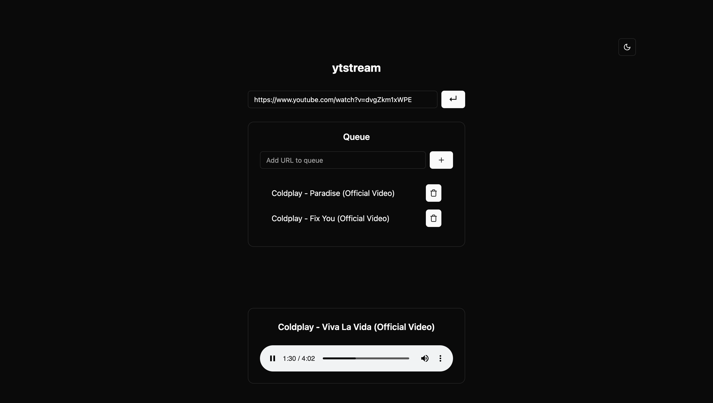

# YTStream

Tired of ads on YouTube while listening to music? Look no further. YTStream is a music streaming application that enables ad-free music streaming from YouTube.



## Why use YTStream
While [yt-dlp](https://github.com/yt-dlp/yt-dlp) and other similar applications enable downloading from YouTube, streaming is an entriely different issue.  With YTStream, it is now possible to stream audio ad-free from YouTube. 

What's more: you can queue audio tracks to play or even jump to any track in the queue, making YTStream your DIY audio streaming app.

## Features
* Ad-free audio streaming from YouTube at the highest quality supported (stereo `OPUS` or `AAC`)
* Autoplay
* Audio queueing
* Navigation/jump-to-track support in queues
* Audio seek, speed and volume control
* Audio download support
* Theme switching (light/dark/system)

Previously a CLI desktop app, YTStream has now migrated to the web!

## Using the App

YTStream has a TypeScript, React + Vite frontend and a Python + FastAPI backend.

To run the app:

1. Clone the repository:
   ```bash
   git clone
   ```

2. Navigate to the backend directory:
   ```bash
   cd backend
   ```

3. Activate the virtual environment (optional)

   Unix-based systems:
   ```bash
   source venv/bin/activate
   ```
   
   Windows:
   ```bash
   venv\Scripts\activate
   ```

4. Install backend dependencies:
   ```bash
   pip install -r requirements.txt
   ```

5. Start the backend server:
   ```bash
   uvicorn main:app --reload
   ```

6. Install frontend dependencies:
   ```bash
   cd frontend
   npm install
   ```

7. Start the frontend development server:
   ```bash
   npm run dev
   ```

8. Open your browser and navigate to `http://localhost:5173` to access the app.
